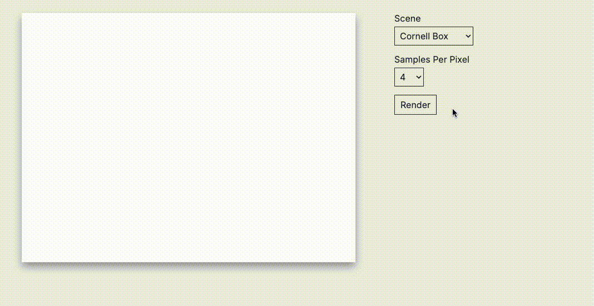

# Raytracer Server

A multithreaded CPU-driven raytracer using pathtracing.


*Streaming render to web client*

To run:
```shell
cargo run --profile=release -- <scenes directory>
```

<!--
To configure the renderer, modify `src/config.rs`:
```rs
pub enum Target {
    Image,
    Window,
}

// The width of the image or window
pub const WIDTH: usize = 600;
// The height of the image or window
pub const HEIGHT: usize = 450;
// Use multiple-importance sampling or not.
pub const USE_MIS: bool = true;
// Render to an image or a file
pub const RENDER_TO: Target = Target::Window;
// If rendering to an PPM image, the path for the output PPM file
pub const PPM_FILE: &str = if USE_MIS {
    "with_mis.ppm"
} else {
    "without_mis.ppm"
};
```
-->
